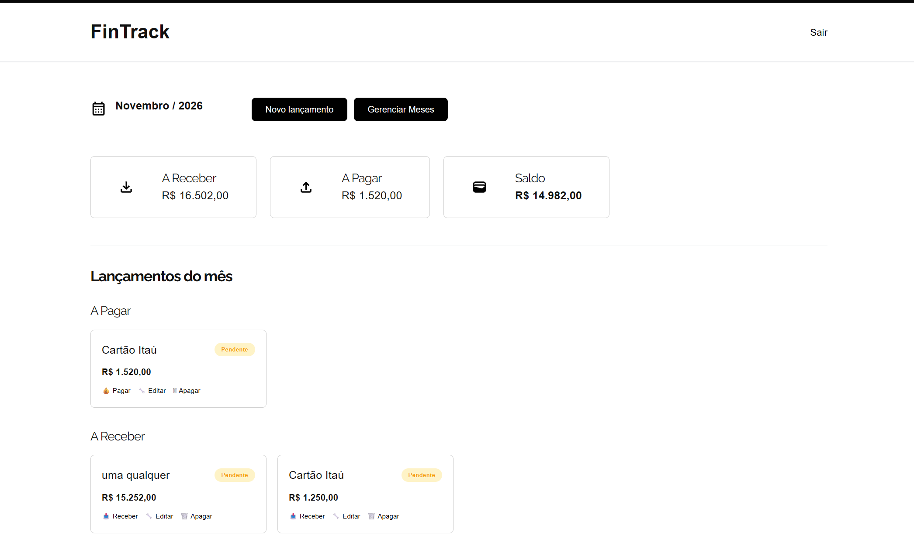
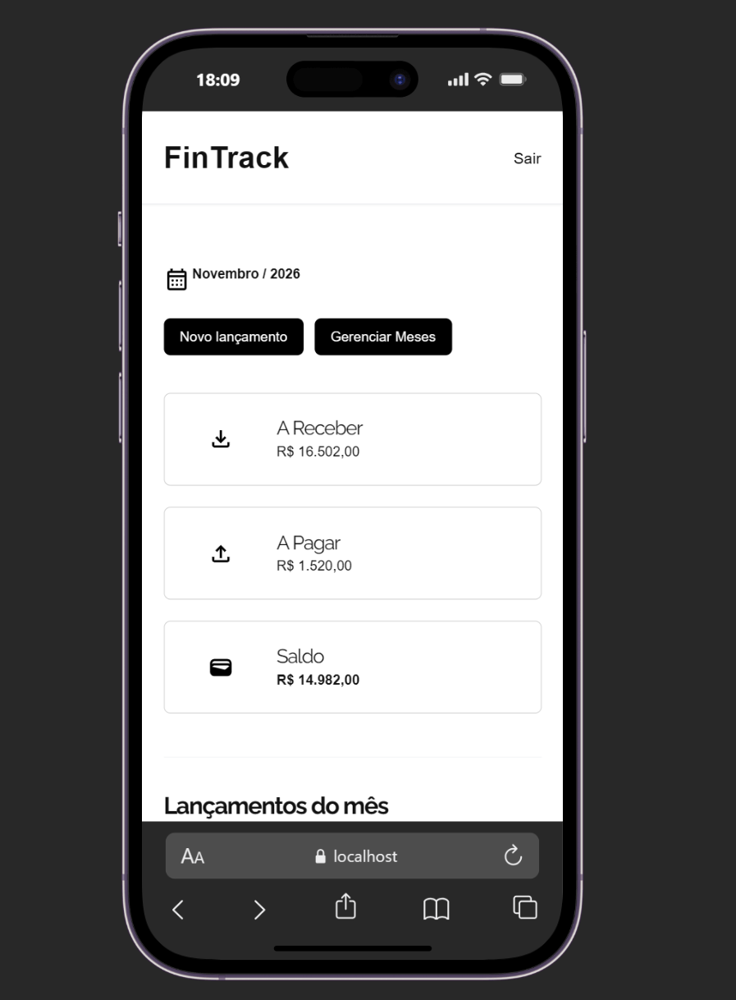

# Fintrack

Sistema de controle financeiro pessoal — cadastro de lançamentos (receitas e despesas) organizados por mês, com autenticação de usuário.

**Acesse online:** [https://fintrack-v5iu.onrender.com](https://fintrack-v5iu.onrender.com)

## Tecnologias

- **PHP 8.2** + **CakePHP 4.5** (MVC)
- **PostgreSQL** (via `pdo_pgsql`)
- **Milligram CSS** (framework CSS leve) + CSS customizado
- **Apache** (servidor web)
- **Docker** (containerização da aplicação)
- **Composer** (gerenciador de dependências PHP)

## Deploy

Aplicação containerizada com **Docker** e hospedada no **Render**. O banco de dados **PostgreSQL** roda no **Neon** (NeonDB), serverless e acessado remotamente pela aplicação.

Fluxo: push no repositório → build da imagem Docker no Render → container conecta na instância Postgres do Neon via variáveis de ambiente.

## Screenshots

### Desktop



### Mobile



## Rodando localmente

```bash
composer install
cp config/app_local.example.php config/app_local.php
# configurar credenciais do Postgres em config/app_local.php
bin/cake migrations migrate
bin/cake server
```
